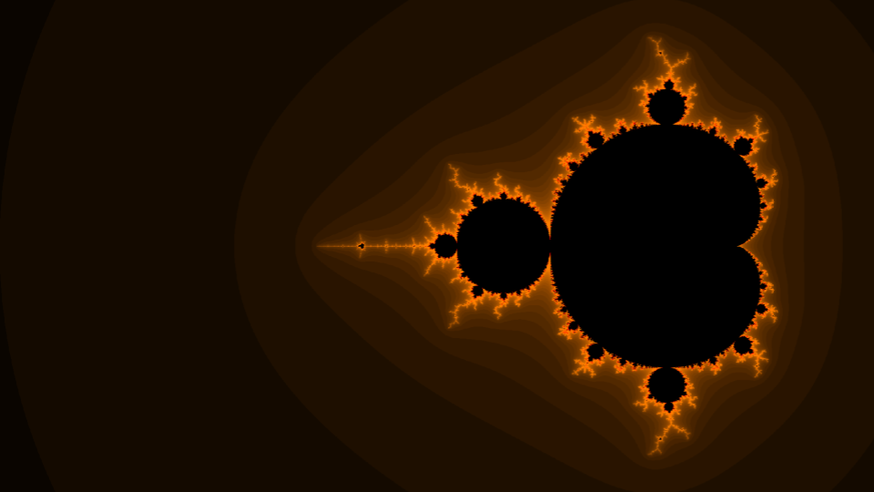

- [Leaderboard](leaderboard.html)
- [Latest Challenge](latest.html)
- [Archive of questions and solutions](archive.html)

## Who are we?

_The Mandelbrot Set_ is the mathematics and linguistics club of [IIT Palakkad](https://iitpkd.ac.in). Currently, we operate under _Stellar Society_, the astronomy club of _IIT Palakkad_. The club is named after the [Mandelbrot Set](https://en.wikipedia.org/wiki/Mandelbrot_set) (of course), which is a set defined as follows

$$ M := \{ z\in\mathbb C | \mathrm{the\,orbit\,of}\,z\,\mathrm{is\,bounded}\} $$

The orbit for some $z\in\mathbb C$ is the following infinite sequence

$$ \langle f_0(z), f_1(z), f_2(z), \cdots \rangle $$

where

$$ f_0(z) := z $$
$$ f_{n + 1}(z) := f_n(z)^2 + z \qquad \forall n \in\mathbb N$$

Here's an image of the Mandelbrot Set that we generated for one of our workshops using [pygame](https://www.pygame.org/).

## The core team

### Leads

- **Rajdeep**: Mathematics lead
- **Raagam**: Mathematics lead
- **Hemanth**: Linguistics lead

### Content creators

- **Anant**
- **Satyam**
- **Sri Krishna**

### PhD representative

- **Tamoghna Kar**

## Semester Timeline

Here's our timeline for the Aug-Dec 2025 semester.

### Regular challenges

These are challenges that we will release weekly or fortnightly. These might include questions that you have to solve, or proofs that you have to write, a combination of both, or something else entirely (who knows).

### Maths quiz (freshers)

**Tentative date:** 3rd week of August

A mathematics quiz organized especially for the freshers (B.Tech. B'25), with the curriculum including topics that they're familiar with, mathematics-related trivia, etc. Participants will participate in teams of 3-4 members, and there will be multiple rounds, potentially including but not limited to the following

- Rapid fire round
- Buzzer round
- Trivia round
- 1v1

### Maths quiz (general)

**Tentative date:** Mid September

This will be a mathematics quiz open to the entire IIT Palakkad community. Participants will again participate in teams, and a team can include participants from multiple "levels" i.e. a team can have B.Tech. as well as M.Tech./M.Sc. students, for example. The kinds of rounds will be similar to that from the [mathematics quiz for freshers](#maths-quiz-freshers). More details will be shared in time.

### Treasure hunt

A mathematics-based treasure hunt with 5-6 rounds, where you employ your mathematics, cryptography and problem solving skills to get to the treasure before your rivals do. The date for this isn't finalized yet. That, and other relevant details will be shared in time.

## License

© 2025 Stellar Society

Licensed under the [MIT License](https://opensource.org/license/MIT)

$$\Huge\varnothing$$

