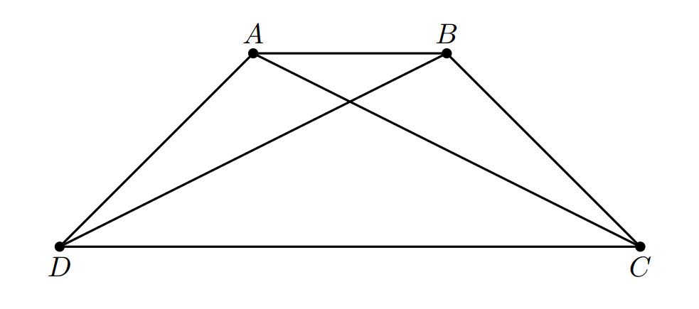

# 10 August, 2025

Let $ABCD$ be a trapezium with $AB \parallel CD$ and diagonals $AC$ and $BD$ intersecting at $O$. The areas of the triangles $\triangle AOB$, $\triangle BOC$, $\triangle COD$, and $\triangle AOD$ are all integers.

It is known that the products of the areas of two pairs of these triangles are $576$ and $1296$, respectively.

- Determine the maximum possible area of the trapezium $ABCD$.
- Find $\dfrac{DC}{AB}$.

*Note:* $AD$ and $BC$ might not be equal, unlike what one might infer from the image.

**Submission:** [Google forms](https://forms.gle/HEaLHSbx46GBVTS6A)

**Deadline:** 17 August, 2025.

$$\Huge\varnothing$$

