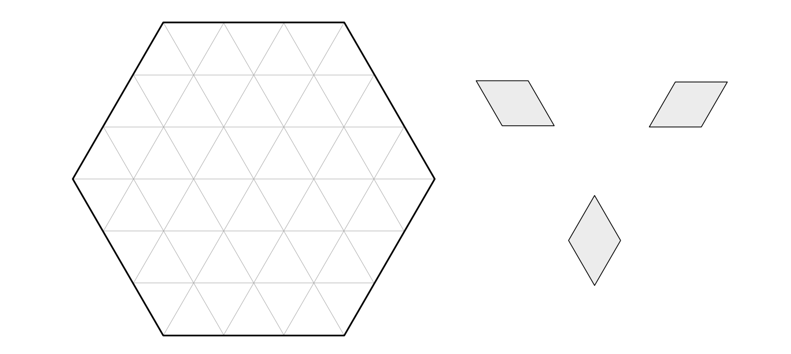

## 17 August, 2025

A large regular hexagon is cut from a triangular grid and tiled with diamonds (pairs of unit equilateral triangles glued together along an edge). Diamonds come in three varieties, depending on orientation. Prove that precisely the same number of each variety must appear in the tiling.

**Submission:** [Google forms](https://forms.gle/P8v4ZSR1gcN6hQq66)

**Deadline:** 24 August, 2025.

$$\Huge\varnothing$$

